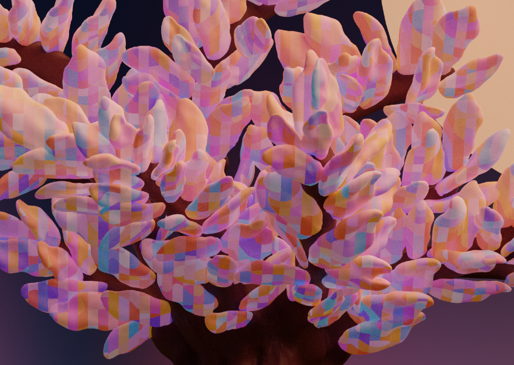

# Fairy tree


This was a fun project made for an art challenge on Discord.

"It is said that deep in the coniferous forests of the Pacific stands the fairy tree. Its leaves shimmering with the energy of possibility, it is a delightful sight. Those who find it may enter the enchanted realms of imagination.
Good luck and safe travels adventurer."

The main attractions of this render I think are:

* the leaves shader
* the sky
* the sculpted trunk and portal

## The creative process

1. First I sculpted the trunk and portal in VR (Quest3) with [Chisel](https://makerscape.info) . I made good use of the flow brush with a fluid hand movement to create the tubes around the portal then I used the flat brush to give the wooden grainy texture to them. I used the pull brush to pull out the branches from the trunk.
2. Then I made 3 different leaves, made an extra layer and copy / pasted the leaves all over the branches. (using the boolean copy / boolean add). Overall it was pretty quick since I could just put my hand at the location of the leave, press the trigger and repeat.
3. Finally I made some background trees (6 variations and 2 bushes) really quick, a simple rock and did a layout of the whole scene (still in VR) to see what it "felt" like. I used separate layer for each object for convenience. Total scene has about 1.2M triangles. At this stage the standalone hardware can still handle it but FPS went down from 72FPS to 60FPS. Not too bad but it's the limit. Hopefully next gen hardware will be able to handle more.
4. At this point I synced the FBX using the Cloud sync to my Dropbox and opened it in Blender.
5. In Blender I worked a bit on the layout, adding a sphere for the moon, it's a PBR with a bit of emission, found some free textures for the rock and grass.
6. I did a quick geometry node to layout the trees in the background. I could not get the instance rotation to work properly so this part is messy.
7. Finally I added the shader code for the leaves and sky.
8. Render

## Shader insights

### General concept

Writing a shader for Blender is very similar to writing a shader for Unity or other engines. But it does not use HLSL, instead Blender uses OSL (Open Shading Language). It's essentially the same but float4 is vector, float3 is color and few other quirks.

Once you have the shader code, you go into Blender shading, add a script node, point it the code (in /shaders here) press the refresh button to compile and hook it up to your material.

Please note that as of today (Dec 2024) in Blender 4.3 using OSL shaders does not work with CUDA graphic cards and requires CPU rendering which is slower.


### Leaves shader


You can play with x/y/z period in the shader node, as well as turn on or turn off use_z, use_y, use_snake (set it ot 0 or 1).

You can turn use_rounded on/off to see the tree pixelated or not.


I won't detail every line of the code, but give a conceptual understanding with code snippets:

* The shader assigns a 3d index based on vertex position, you can think of it as a 3d grid. The index has some periodicity along all axes (getGridIdx)

```
point(floor(pos[0] / _XPeriod), floor(pos[1] / _YPeriod), floor(pos[2] / _ZPeriod))
```

* There is a secondary grid (cubeWithStripes) that creates an interesting space ordering, this is the creative part, I came up with the formula by trial an error, it is also periodic to create repeating patterns, but has a deterministic variation factor (use\_snake, use\_z) to create some interesting effect. Each cell of the standard (cartesian) grid gets a 3d index and 3 mixing coefficients. The colors are mixed to create the cell color. We basically play with adding the x index to the y index and so forth to create the pattern
* Finally, each cube of the normal (cartesian) 3d grid has a color (the one we just mixed), the vertex then takes the color based on lerping (mixing) the colors from its cell and the other cells around it, this is what creates the "bubble gum" effect.

```
    color colBottom = mixColors(colBL, colBR, fractional.x, useCielHere);
    color colTop = mixColors(colTL, colTR, fractional.x, useCielHere);

    color colBottomZ = mixColors(colBLZ, colBRZ, fractional.x, useCielHere);
    color colTopZ = mixColors(colTLZ, colTRZ, fractional.x, useCielHere);

    color finalColor = mixColors(colBottom, colTop, fractional.y, useCielHere); 
```

* Note: we use the CIE Lab color space for some of the color mixing (in cube with stripes). It's a mixing technique that lets you go from one color to another by following the color wheel instead of straight up RGB mixing, I think it adds quality and charm to the overall color palette. You will notice we also convert to HSV (Hue Saturation Value) to correct the value and make it brighter.

```

    color ciela = toCiel(cola);
    color cielb = toCiel(colb);

    color cielMixed = ciela * (1.0 - t) + cielb * t;
    color mixed = inverseCiel(cielMixed);
    color hsv = rgb2hsv(mixed);
    hsv.b = 0.6;
    mixed = hsv2rgb(hsv);
```

* At some point I will animate this shader by adding an offset and truly make it iridescent. I will update the code once I do.

### Sky shader

I did not have time to fully finish it but it's a good base for what I want to do later. Eventually this shader will be a fully blown northern lights shader.

* We compute the elevation from the horizon line,
* We compute the panomaric angle
* We diffuse some horizon color upwards slowly going into the darkness
* We add some varation using some trigonometrics functions to the angles to create some smooth transitions
* There are a few colors overlaid, py playing with frequency and phase you can get them to superpose etc
* To see the sky shader in Blender, go into shading and change the mode from Object mode to World mode


# Closing words

I hope this was helpful, if you enjoyed this, check out my indie studio at [https://makerscape.info](https://makerscape.info)
